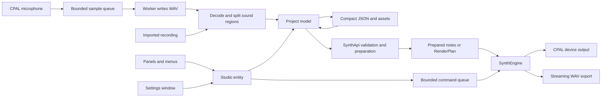

# Overtone structure and connections

All authored Rust/application files are `.rsx`. `src/build.rsx` converts them into generated `.rs` files in Cargo's `OUT_DIR`. Generated sources are not the editing surface.

## Source modules

| File | Responsibility |
| --- | --- |
| `src/main.rsx` | Desktop lifecycle, native window and menus |
| `src/core.rsx` | Public, device-independent model/persistence/synthesis library; optional device API |
| `src/model.rsx` | Project, sounds, harmonics, noise, envelope, tuning, tracks, notes, clips, profiles and validation |
| `src/storage.rsx` | Compact schema-2 JSON, patch interning, legacy migration, standalone workspace settings |
| `src/persistence.rsx` | Atomic saves, project loading, portable voice-reference copies and hash verification |
| `src/studio.rsx` | Shared GPUI controller/entity: actions, input/slider subscriptions, history, dialogs, layout gestures, background I/O, engine bridge |
| `src/panels.rsx` | Music components; controls read the shared project and dispatch actions |
| `src/reconstruction.rsx` | Movable waveform editor, original overview/detail, summed and individual sine canvases, cleanup controls |
| `src/reconstruction_ui.rsx` | Background source cache, inspection/cleanup actions and draft/instance targeting |
| `src/waveform.rsx` | Bounded peak bins and parameter-driven sine display data, independent of GPUI/devices |
| `src/primitives.rsx` | Buttons, knobs, sliders, scale scope, palettes, scrollbars and directional inner shadows |
| `src/workspace.rsx` | Dock layout, paired panels, resizing, drag preview, menus, modal project dialogs |
| `src/settings.rsx` | Separate native Settings window observing the same Studio through a weak reference |
| `src/engine.rsx` | Validated UI-to-DSP adapter, compiled samples/patches/notes, timeline planning, sample and additive renderer, streaming WAV writer |
| `src/analysis.rsx` | Bounded file decoding, silence segmentation, optional whole-take analysis, FFT pitch estimation, harmonic/noise/ADSR fitting |
| `src/capture.rsx` | Optional microphone input, lock-free sample queue, durable WAV writer and status atomics |
| `src/capture_ui.rsx` | Background recording/analysis lifecycle, library ingestion and individual auditions |
| `src/audio.rsx` | Optional CPAL device negotiation, stream ownership, bounded UI-to-audio queue and status atomics |
| `src/render.rsx` | Headless WAV-render/demo and release benchmark CLI |
| `src/ui_tests.rsx`, `src/engine_tests.rsx` | Native interactions/export checks and DSP/real-time invariants |

## Components and shared data

| Component | Reads/edits | Connection |
| --- | --- | --- |
| Voice reference | `sources`, draft's optional `source` ID | Records/imports hashed audio, splits recordings into individual sample sounds and timeline clips; source files remain available for another split. |
| Sound library | `library`, transient search query | Listen auditions the recorded region or legacy patch; Add to timeline creates an independent playable instance. |
| Harmonic builder | `draft.harmonics`, name, selected harmonic/bank | 1–32 amplitudes, phases and detunes; writes the sound model and can update its active preview voices. |
| Waveform reconstruction | Draft or selected clip sound, source asset, persisted cleanup/display preferences | Background-decodes the immutable source once; displays original samples above the sum and individual sine contributions; manual/threshold cleanup shares existing sliders, audition, saving and undo paths. |
| Tone & noise | Draft noise/color, gain, brightness and ADSR | Knobs/sliders share the same values and translate through SynthApi. |
| Keyboard | Selected clip's `notes` | Creates a draft instance if necessary, appends a one-beat note; auditions the clip's sound when device preview/playback has been started. |
| Timeline | Tracks and clips | Accepts sound-card drops or existing clip moves, snapping to destination-track beats; places clips in seconds; stores legacy notes/durations in beats; recorded clips keep their sample duration in seconds. |
| Sound instance inspector | Selected clip's own sound, notes, timing, gain/mute | Recorded clips expose level/mute, track, timing, duplication and source-bound splitting. Legacy edits change only this instance. Reset restores `original_sound`; neither the library nor other clips changes. |

Components do not store separate copies of UI-authoritative sound parameters. Input and slider entities mirror the Project model. Actions update that model; rendering reads it; Undo/Redo restores complete project snapshots. Playback/output state, search, focus, scroll positions, drop previews and undo stacks are transient.

Workspace profiles store an ordered placement for every module: dock, enabled state, full/half row, paired share, optional fixed height, spacing overrides and local zoom. The profile also stores dock dimensions, default gaps/padding and global zoom. Settings is the only place to disable modules. A profile changes layout; it does not duplicate composition data. Both `.overtone` project saves and standalone workspace-settings JSON retain these layouts.

## Saved structure

The project contains tuning, recording/analysis preferences, a draft, saved library sounds, voice references, tracks, clips and workspace profiles. Patches can carry capture metadata (selected-take start/duration, fundamental frequency and confidence); their source ID identifies the original audio asset. Persistent objects have IDs; asset and library relationships use those IDs. On disk a deduplicated `patches` table stores sound parameters, while draft/library/clip records reference table indices. On loading, patches expand into independent mutable sound values. Identical definitions sharing one file entry never implies linked instance editing.

Harmonics are compact rows `[multiple, amplitude, phase_degrees?, detune_cents?]`; absent trailing phase/detune means zero. Notes are `[midi, start_beat, duration_beats, velocity]`. Noise includes color, level and a 64-bit seed; envelope times use milliseconds. Clip starts use seconds; notes and lengths use beats. Current and reset-baseline patches both persist. Voice files live beside the project in `<stem>.assets/sources/`, with relative paths and SHA-256 fingerprints.

See [PROJECT_FORMAT.md](PROJECT_FORMAT.md) for the complete schema and [ENGINE.md](ENGINE.md) for parameter mapping, API, playback limits and algorithms.

Library records now have a three-dot menu. Edit selects a persisted library ID as the draft’s save target; Save replaces the same record. Save as new allocates a separate ID. Removal detaches library provenance on placed instances, whose sound and reset snapshots remain independent. Undo/redo covers these operations. Timeline time zoom and beat-snap settings belong to the project workspace; playback position and paused state belong to `Studio`, and the audio callback publishes the rendered sample frame through an atomic counter.

The reconstruction editor caches one source by ID/path/hash/byte count, verifies it, and decodes it off the UI thread. Generation and source epochs discard stale results after a project/source switch. The full-recording overview has 2,048 min/max bins; the detail cache is mono at at most 48 kHz and at most 120 seconds. Each harmonic and the sum use 2,048 display points, regenerated only when sound parameters, inspection time or display cycles change. Canvases skip drawing outside the content mask. This transient display cache never enters project JSON or the realtime audio callback. Source failures leave an honest placeholder with the synthesized curves still editable.

The default Recording desk hides synthesis/reconstruction/keyboard panels. Splitting uses `analysis::split_file` and `Project::add_recorded_sounds` to assign independent IDs, preserve take spacing and create immediately playable clips. `recorded_sample` and source bounds persist in deduplicated patches. `SynthApi` verifies/decodes each source once per plan, sharing buffers across its scheduled sample voices; the callback interpolates and mixes samples without file access. The plan retains buffers until control-thread teardown. Audition sessions likewise retain their decoded sample buffer. Recorded waveform previews cache by source SHA-256 and reset when a project is replaced.
