# FFmpeg editing MVP

The first milestone connects local project media to an in-process video decoder and a non-destructive timeline. It preserves the existing RSX screens and docking. Startup opens an empty project. `--demo` imports real bundled files; historical visual data is compiled only into editing tests. Real processing, timeline undo, save/open and MP4 export now connect the full basic workflow.

## Implemented

- Native multi-file import and recursive folder import into the current project catalog.
- Canonical source paths for duplicate detection, original folder grouping, real file sizes, codec/duration/resolution/frame-rate metadata, and thumbnails.
- Grid/list selection, search, filters, automatic timeline insertion on import, and **Add to timeline** for repeat insertion. Videos append; audio-only sources overlay at the current playhead.
- Native video and channel audio playback with play/pause, seeking, stepping, and looping. In Media, preview plays the source. Edit plays the complete timeline against the audio device clock, mixing overlaps, keeping gaps silent, and selecting the highest visible video track.
- Preprocessing every video/audio stream in one native demux pass, with disk-backed keyframe indexes, lossless mono PCM caches, measured waveforms, native channel names, and stream timing.
- Timeline insertion creates a video track and a separate track for each audio channel (including secondary audio streams). Timestamp gaps become separate clip spans. Linked split/delete keeps streams aligned; a locked linked track blocks the operation. Clip metadata selects a source stream/channel and range; source files remain untouched.
- Background import with cancellation, per-file inspection errors, source-change detection, and temporary cache cleanup.
- Native clip/track/media context menus, project-local inline names, linked duplicate/move/trim commands, and track reordering through drag handles or menu commands. Reordering remaps clip track indices without changing channel caches, source ranges, or links; track state travels with the row. Drag payloads carry the editor identity and track revision to reject stale or cross-editor drops.

- Working clip timing, naming, visibility and track audio Inspector. Clip body dragging moves linked media; edge handles shorten or extend original source ranges without resampling or changing playback speed. The gesture keeps a fixed time scale, accounts for horizontal scroll, pauses transport, and supports Escape cancellation. Source metadata retained per link group restores hidden channel spans and timing gaps after trims, split/duplicate, and track reordering.

## Architecture

```mermaid
flowchart LR
    F[Files or folder] --> C[Background discovery and inspection]
    C --> P[Native video indexes and mono PCM channels]
    P --> W[Bounded waveform pyramids]
    P --> A[Shared immutable source analysis]
    A --> T[Timeline clip ranges]
    T --> M[Worker: native PCM reading and libswresample mixing]
    M --> B[8192-frame SPSC audio queue]
    B --> O[CPAL device callback]
    O --> K[Shared device clock]
    K --> R[Latest native video request]
    T --> R[Latest native video request]
    R --> D[FFmpeg decoder worker]
    D --> S[libswscale BGRA preview]
    S --> Q[Bounded two-frame queue]
    Q --> U[GPUI image and playhead]
```

`catalog.rs` scans regular local files, skips directory symlinks, sorts paths, and deduplicates canonical paths. `preprocess.rs` demuxes and decodes audio; `media.rs` links FFmpeg through `ffmpeg-next` 9 (`libavformat`, `libavcodec`, `libavutil`, `libswscale`). Import and preview use the libraries directly. The preserved `--legacy` export demonstration still uses the FFmpeg CLI.

One preview worker owns the input, decoder, and scaler. It keeps the decoder open while the source stays the same. Seeking goes to a preceding keyframe, flushes the decoder, then decodes forward to the requested timestamp. Frames before the requested timestamp are discarded before scaling. Packet and frame handling follows FFmpeg's send/receive API, including EOF draining.

The preview is scaled to fit 960 × 540 without upscaling. BGRA rows are packed using the FFmpeg stride and passed directly to GPUI's render images; there is no JPEG/PNG encode/decode cycle during playback. This still copies scaled pixels into an owned buffer and uploads them to the GPU; it is not zero-copy rendering. PNG encoding is used only for library thumbnails.

The presentation queue holds at most two scaled frames (about 4 MiB at the maximum preview size). This bounds queued preview memory, not FFmpeg's internal source-resolution buffers or GPU memory. A slow UI drops playback frames. Playback uses source timestamps and a monotonic clock. Requests are coalesced into a single mailbox; generation IDs reject stale UI frames. The worker checks new requests between decoded frames, and closing the editor interrupts FFmpeg I/O. Replaced preview images are removed from GPUI's sprite atlas.

The editing model is metadata, not a video-sized pixel buffer. Video stays in its original encoded source; no video proxy or intermediate transcode is made. Preview scaling uses Lanczos with accurate rounding; the 8-bit BGRA display buffer is independent of original bit depth/color metadata and is not an export master.

`PreparedMedia` is shared through `Arc`; owned stream/channel arrays are compact boxed slices. Native stream time bases and integer PTS remain in analysis. Every audio stream is decoded once into one mono PCM file per channel, retaining its decoded sample precision, sample rate, ordering, and floating-point headroom. Packed samples are deinterleaved; planar samples are copied directly, excluding FFmpeg buffer padding. There is no resampling, downmix, normalization, or additional lossy encoding. A lossy source such as AAC still has its original codec loss; the cache preserves its decoded output. Each PCM writer uses 64 KiB buffering with scratch reused between frames. Random reads are capped at 1 MiB. Changes in sample encoding, sample rate, or channel count within a stream produce an import error. Undeclared channel layouts use numbered labels. Decoder packet time bases preserve priming/discard offsets. Vorbis variable-window samples are anchored to packet ends when packet duration differs from decoded sample count, preventing false gaps/overlaps without changing PCM bytes.

Each channel has a min/max waveform pyramid. Its base starts at roughly 100 peaks per second, then coarsens adaptively to stay below 131,072 peaks; all pyramid levels together use fewer than twice that count plus rounding. Queries return at most 1,024 columns and UI painting clips amplitude only for display. Keyframe records are fixed 24-byte disk entries and monotonic indexes support binary search. Preview consumes the selected video stream's index, then decodes forward. Nonmonotonic indexes fall back to FFmpeg seeking. Timing spans preserve audio discontinuities; their metadata grows with discontinuity count, not sample count. Decoded frame/decoder memory is still native FFmpeg memory, and PCM disk size grows with duration/channel count.

Analysis includes a versioned JSON manifest with source size/modification time, native endianness, stream/codec/color metadata, sample encodings, channel paths, and timing. Unchanged sources reuse analysis within the session. Failed/cancelled preprocessing removes partial cache directories; successful caches live until the last asset analysis reference is dropped or the temporary workspace closes. A stat fingerprint is not a content hash and cannot detect changes that preserve both file size and modification time. Waveforms are session-resident summaries. Project reopening regenerates them from saved source references.

## Playback data flow

A playback plan shares source analysis through `Arc`, with clip/channel/range references. The audio worker reads bounded PCM chunks and resamples native channels to the output device rate using libswresample (64-tap sinc configuration). It mixes blocks of 512 stereo frames. The 8,192-frame SPSC ring holds roughly 256 KiB. The normal device callback performs no allocation, disk access, or mutex locking. Seek generations reject stale queued frames; the callback clamps only the stereo monitor output and counts clipping/underruns. Originals and channel caches retain their decoded precision and sample rates.

The master clock follows device callback/DAC timing. Video requests translate that clock into each source clip's range; native decoding skips frames already late before scaling. Preview retains a two-frame bounded queue and a single GPU image. Cuts select the highest visible video track; video gaps show black. Audio gaps remain silence. Muted tracks are excluded from the plan; gain affects the monitor mix. Source preview uses the first audio stream, while timeline playback includes all imported streams/channels. Looping rebuilds the plan at its start.

## Current limits

Projects persist as versioned JSON; source references must remain available. Generated session assets are copied beside the saved project. Dock layouts, transport position and undo history remain session-local. Highest-visible-track playback/export does not composite layers. Still images play and export on the timeline. Stereo output uses fixed speaker-channel mapping and clamps summed samples outside ±1; native caches retain headroom. Audio edits rebuild the worker plan and may briefly restart transport. No hardware decoding or color-managed HDR output is claimed. Filmstrips repeat source posters. Unfinished editing controls have been removed.

Export uses native libavcodec/libavformat with H.264 YUV420P at 30 fps and a source-shaped canvas capped at 1920 × 1080; stereo AAC is 48 kHz/192 kbps. Sequential source decoders and a retained current/next frame keep render buffering bounded; decoded source buffers remain FFmpeg-owned. Still-image loading uses the image decoder before scaling. Audio mixing uses the same source/channel ranges as playback, independently of preview mute/gain. A temporary sibling directory holds output until encoders drain and the MP4 trailer is written. Atomic hard-link publication preserves existing targets. Cancellation, changed sources and encoding errors discard partial output. The compositor graph remains an independent single-frame/audio-excerpt workflow and is saved with the project; it is not applied continuously to the timeline export.

## Next milestones

Missing-source relinking, snapping/ripple editing, speed changes, fades/envelopes, continuous compositor playback/export, color management and hardware/performance work remain future enhancements. Their former placeholder controls are removed.

## Validation

Tests exercise nested discovery, directory symlink loops, duplicate imports, cancellation, actual bundled-video metadata/thumbnails, FFmpeg decoding and seeking, packed frame bounds, queue termination/backpressure, source offsets after splitting, linked deletion/track locking, and project duration growth. Additional checks cover byte-exact stereo separation, planar float headroom/padding, bounded random reads and waveform pyramids, native 10-bit video and multiple audio sample rates, manifests, and partial-cache cleanup. The bundled multichannel fixture needs no runtime CLI process. The real bundled-media test verifies automatic insertion, every channel track, playhead overlays, duplicate imports, and unchanged source bytes. Playback tests verify native seek offsets, gap silence, overlap gains, device-rate pitch, and stale-generation rejection. Hardware evidence and reproduction are recorded in [PROOF.md](PROOF.md). Build the RSX output and run the example library tests as described in README.

Reference APIs: [ffmpeg-next](https://docs.rs/ffmpeg-next/9.0.0/ffmpeg_next/), [FFmpeg send/receive decoding](https://ffmpeg.org/doxygen/3.3/group__lavc__encdec.html), [native sample layouts](https://ffmpeg.org/doxygen/9.0/group__lavu__sampfmts.html).

## Compositing graph MVP — 2026-10-05

The Compositing tab hosts an independent graph. `composition.rs` keeps stable session node IDs, positions, typed operations and input references; connection replacement rejects cycles, output-to-input misuse and cross-media edges before mutation. Deletion removes dependent wires. A topological traversal evaluates only connected output dependencies, sharing results for fan-out instead of decoding a source again per edge. The preview caps the graph at 32 nodes. The palette lists actual imported stream/channel references and graph settings remain separate from timeline clip controls.

`graph_editor.rs` implements header dragging with scroll compensation/Escape rollback, port selection, editable settings, arrangement, render revision tracking and audio audition. The RSX canvas paints wires and a grid. Background rendering snapshots graph metadata and clones asset references with shared `Arc<PreparedMedia>` caches; no FFmpeg contexts enter the UI thread. Stale results stay visible but cannot be inserted or auditioned until rerendered. Source fingerprints are checked before processing; changed sources require reimport.

`compositing.rs` uses native libavfilter buffer sources/sinks for scale (Lanczos), hflip, saturation, overlay, volume and amix. Each reachable node processes bounded intermediates: video fits 960 × 540; audio is at most ten seconds, read in chunks of at most 1 MiB, with source sample rates capped at 384 kHz. Audio source spans map native PTS into the source preview window, preserving discontinuities and stereo channel positions. Processing uses floating point, 64-tap native resampling, and 48 kHz stereo output. The rendered WAV is 32-bit float and retains headroom; audition uses the existing bounded CPAL monitor (which clamps only output). PNG/WAV files are published only after evaluation succeeds, in unique temporary session directories. The imported original media and native channel caches are untouched.

Current graph output is one frame plus an audio excerpt, independent of timeline clip offsets. Adding a result puts the frame into Media and the stereo audio onto separate linked timeline tracks. Project/graph persistence, graph and timeline undo, and timeline encoding are implemented. Next: continuous timestamped graph playback/export, explicit color management, richer routing and processing nodes, cancellation and measured memory/latency budgets. Existing timeline video playback still chooses the highest visible track.

Filter semantics follow the [official FFmpeg filter documentation](https://ffmpeg.org/ffmpeg-filters.html).
